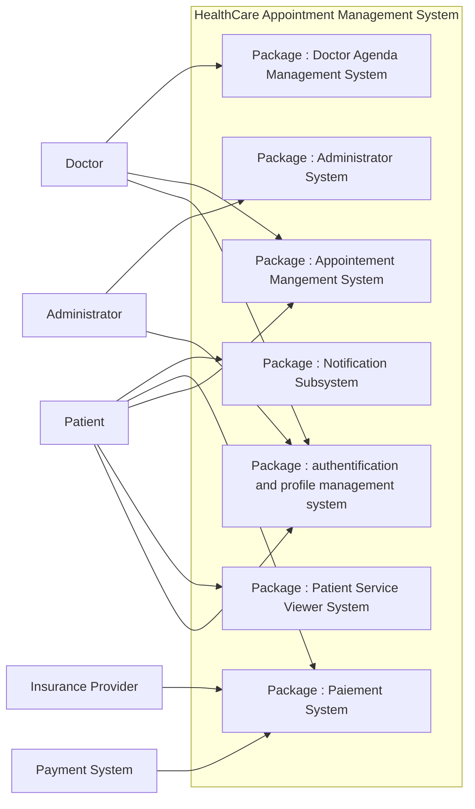
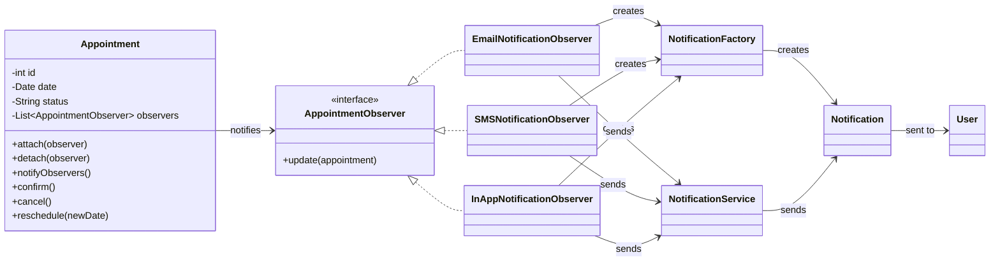
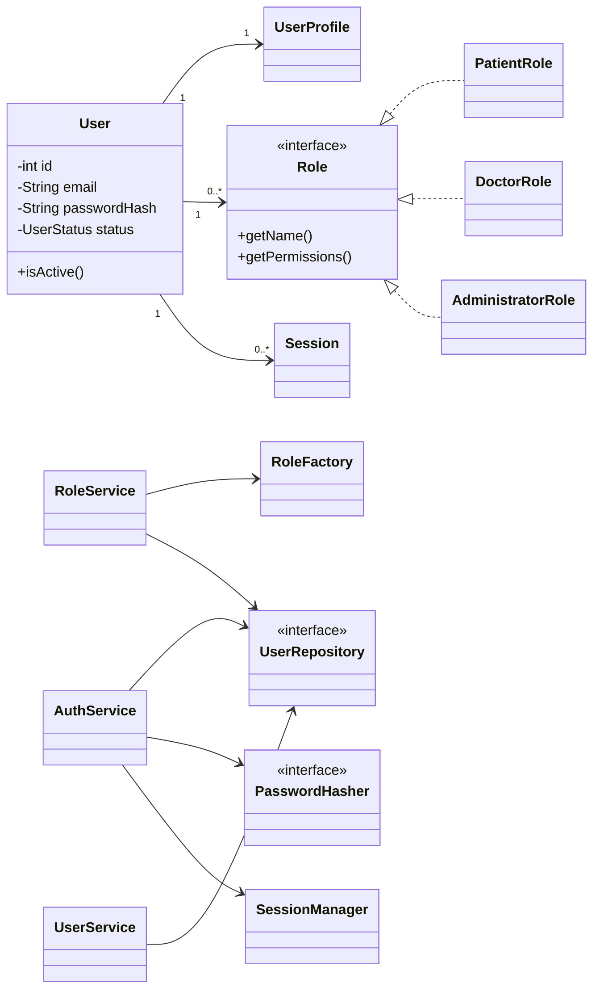
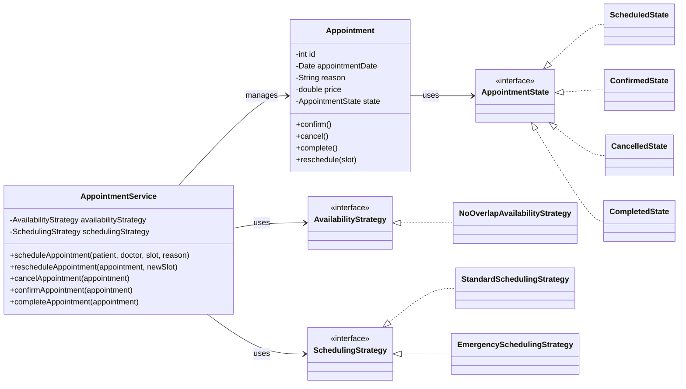
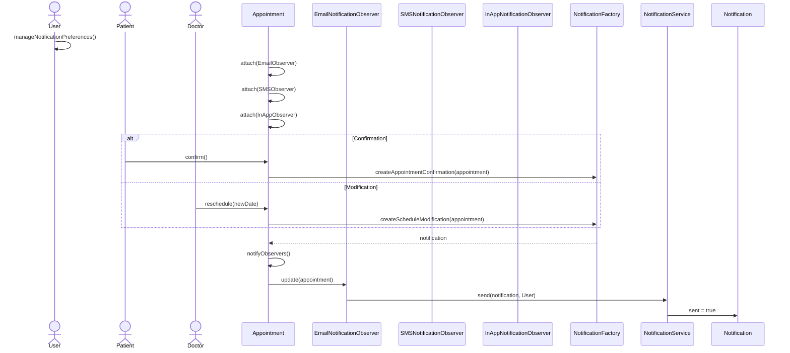
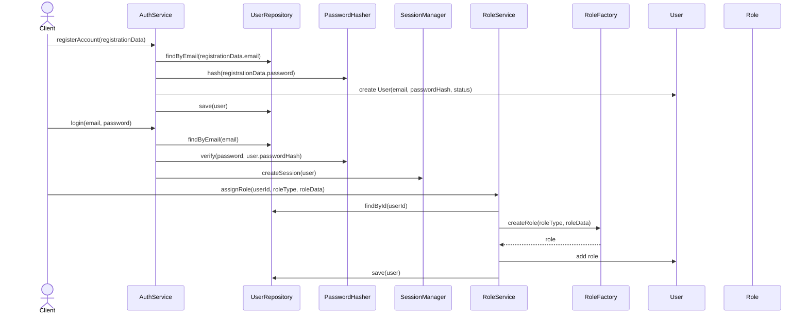
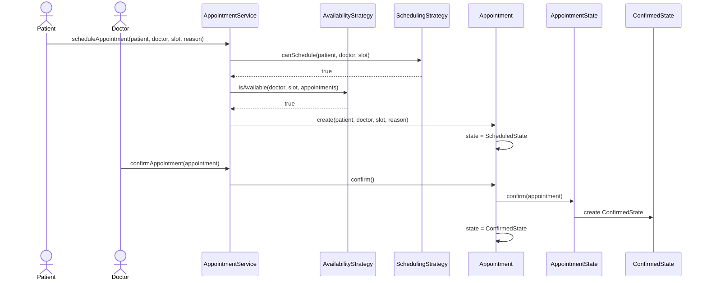

# HealthCare Appointment Management System

**Course context:** Software Design project  
**Group members:**

- Nicolas Papleux
- Arnaud Van Eeckhoven
- Romain Dangin
- Nail FAHIM

## 1. Introduction

This project designs a **HealthCare Appointment Management System**. The goal is to model a modular healthcare platform where patients can browse clinics, doctors, and healthcare services, then manage medical appointments. Doctors can manage their agenda and availability. The platform also includes authentication, profile management, payments, notifications, and administration.

The project is decomposed into functional domains, close to a microservice-oriented architecture. Each folder represents a responsibility of the platform and contains UML diagrams written in **Mermaid**.

Our working method was iterative. We first built a general use case diagram to understand the overall scope. From that use case diagram, we created first class diagrams "on the fly", without immediately applying SOLID and GRASP principles in a systematic way. These first versions helped us identify entities, services, and responsibilities quickly.

Then, we reviewed and improved the diagrams by applying SOLID and GRASP principles. The improved `v2` diagrams reduce coupling, improve cohesion, introduce interfaces, and use design patterns where responsibilities needed to vary or be extended. This approach allowed the team to compare initial designs with refined designs and better justify the final architecture.

## 2. Problem Statement

Healthcare appointment management involves several actors and many business rules. The system must coordinate patients, doctors, appointments, availability, payments, notifications, authentication, profile management, and administration.

Without a clear design, such a system can quickly become tightly coupled. For example, appointment logic could become mixed with notification sending, user authentication, payment calculation, or doctor agenda rules. This would make the application hard to maintain and hard to extend.

The design objective is therefore to propose a modular, maintainable, and extensible object-oriented architecture. The architecture must separate responsibilities, keep domain concepts clear, and allow future extension such as new notification channels, new user roles, new payment rules, or new scheduling strategies.

## 3. Functional Requirements

The following requirements summarize the README and the use case diagrams.

### Patient Features

- Browse clinics and healthcare services.
- Search services and filter them by specialty, location, or availability.
- View clinic details, service details, and doctor profiles.
- Schedule, modify, cancel, and view appointments.
- View appointment history.
- View billing information and select a payment method.

### Doctor Agenda Features

- Define working hours.
- Update availability.
- Block unavailable periods.
- View daily and weekly agenda.
- View scheduled appointments.
- Notify patients when schedule changes affect appointments.

### Appointment Management Features

- Schedule appointments.
- Select an appointment slot.
- Check doctor availability.
- Validate scheduling constraints.
- Prevent overlapping bookings.
- Confirm, modify, cancel, and complete appointments.
- Generate notifications when appointment events occur.

### Authentication and Profile Management Features

- Register an account.
- Log in and log out.
- Reset password.
- Manage profile information.
- Update personal information.
- Change password.
- Manage notification preferences.
- Verify user identity.

### Notification Features

- Generate appointment-related notifications.
- Send appointment confirmations.
- Send appointment cancellations.
- Send appointment reminders.
- Send schedule modification notifications.
- Support email, SMS, and in-app channels.
- Manage user notification preferences.

### Payment Features

- View billing summary.
- Select a payment method.
- Support credit card, insurance coverage, and digital wallet.
- Calculate final price.
- Apply insurance coverage and promotions.
- Simulate and confirm payment.

### Administrator Features

- Manage users, including creation, modification, deletion, suspension, and role assignment.
- Manage clinics.
- Manage healthcare services.
- Assign doctors to services.
- Configure system settings, pricing rules, promotions, and notification settings.
- Monitor appointments and system activity.

## 4. Overall Architecture

The system is divided into functional domains. Each domain is stored in a dedicated folder and can be understood as a microservice-like sub-project.

| Folder | Responsibility |
| --- | --- |
| `overview` | Global view of the platform and subsystem interactions. |
| `authentification-and-profile-management` | Authentication, sessions, profiles, and roles. |
| `patient-service` | Clinic, healthcare service, search, filter, and doctor profile browsing. |
| `appointement-management` | Appointment scheduling, modification, cancellation, and lifecycle. |
| `doctor-agenda-management` | Doctor agenda, working hours, availability, and unavailable periods. |
| `paiement-system` | Billing, payment methods, insurance, promotions, and payment simulation. |
| `notification` | Email, SMS, and in-app notifications. |
| `administrator-system` | Administration of users, clinics, services, prices, promotions, and settings. |
| `class_diagramms` | General or transversal class diagrams. |

This decomposition helps enforce separation of concerns. Each subsystem has a clear responsibility and can evolve independently. It also makes SOLID and GRASP principles easier to apply, because the design can focus on cohesive business areas instead of one large monolithic model.

## 5. UML Diagrams

All diagrams in the project are written in Mermaid. The following sections include meaningful excerpts from existing project files.

### 5.1 Use Case Diagram

The general use case view comes from `overview/use-case_general-simplified.md`. The full file shows the main actors and their links to the platform packages. The excerpt below focuses on the overall system decomposition.



The main actors are `Patient`, `Doctor`, `Administrator`, `Payment System`, and `Insurance Provider`. The diagram shows that the platform is not centered on a single class or module, but distributed across functional packages.

### 5.2 Class Diagrams

#### Notification System

Source: `notification/class-diagram_notification_v2.md`.



In the initial `v1` design, notification responsibilities were less separated. In the improved `v2` design, `Notification` mainly represents data, `NotificationService` sends notifications, and `NotificationFactory` creates appointment-related notification objects. `Appointment` only knows the `AppointmentObserver` interface, which reduces coupling.

#### Authentication, Profile, and Role Management

Source: `authentification-and-profile-management/class-diagram_authentification-and-profile-management_v2.md`.



The initial design used inheritance between `User`, `Patient`, `Doctor`, and `Administrator`. The `v2` design replaces that approach with a `Role` abstraction. Authentication, profile updates, session management, and role assignment are handled by separate services, improving cohesion and reducing the responsibilities of `User`.

#### Appointment Management

Source: `appointement-management/class-diagram_ appointement-management_v2.md`.



The `v2` design separates orchestration from lifecycle behavior. `AppointmentService` coordinates use cases, while `Appointment` owns its lifecycle state. Availability and scheduling rules are externalized behind strategy interfaces, making the design easier to extend.

### 5.3 Sequence Diagrams

#### Notification Flow After Appointment Change

Source: `notification/sequence_notification.md`. This excerpt shows the main Observer and Factory interaction.



The interaction demonstrates the Observer Pattern. `Appointment` triggers a change, creates or obtains the corresponding notification through `NotificationFactory`, then notifies observers. Each observer decides whether to send through its channel depending on user preferences.

#### Authentication, Profile, and Role Flow

Source: `authentification-and-profile-management/sequence_authentification-and-profile-management.md`. This excerpt focuses on registration, login, and role assignment.



This interaction demonstrates SRP and DIP. `AuthService` handles authentication, `RoleService` handles roles, `UserRepository` abstracts persistence, and `PasswordHasher` abstracts password hashing. `RoleFactory` centralizes role creation.

#### Appointment Scheduling and Lifecycle Flow

Source: `appointement-management/sequence_appointement-management.md`. This excerpt shows scheduling and state transition.



The interaction demonstrates GRASP Controller because `AppointmentService` coordinates the use case. It also demonstrates Strategy for scheduling and availability rules, and State for valid lifecycle transitions.

## 6. SOLID Principles Application

### Single Responsibility Principle

Each class should have one main reason to change. In the authentication subsystem, `User` no longer manages authentication, sessions, roles, and profile updates. These responsibilities are separated into `AuthService`, `SessionManager`, `RoleService`, and `UserService`.

In appointment management, `AppointmentService` orchestrates use cases, while `Appointment` manages its lifecycle. In notification, `NotificationService` sends notifications, `NotificationFactory` creates them, and observers react to appointment events.

### Open/Closed Principle

Classes should be open to extension but closed to modification. In the notification system, a new channel can be added by creating another `AppointmentObserver`, without modifying `Appointment`.

In authentication, new role types can be added through new `Role` implementations and `RoleFactory`. In appointment management, new availability or scheduling policies can be added through new `AvailabilityStrategy` or `SchedulingStrategy` implementations.

### Liskov Substitution Principle

Subtypes should be usable through their abstraction. `PatientRole`, `DoctorRole`, and `AdministratorRole` can all be used through the `Role` interface. Similarly, `ScheduledState`, `ConfirmedState`, `CancelledState`, and `CompletedState` can be used through `AppointmentState`.

This makes client code depend on stable contracts instead of concrete classes.

### Interface Segregation Principle

The design introduces small, specific interfaces instead of forcing classes to depend on large general ones. Examples include `AppointmentObserver`, `UserRepository`, `PasswordHasher`, `Role`, `AvailabilityStrategy`, and `SchedulingStrategy`.

Each interface represents a focused behavior, which keeps implementations simple and understandable.

### Dependency Inversion Principle

High-level services depend on abstractions instead of concrete implementations. `AuthService` depends on `UserRepository` and `PasswordHasher` interfaces. `AppointmentService` depends on `AvailabilityStrategy` and `SchedulingStrategy`. `Appointment` depends on `AppointmentObserver`, not on email, SMS, or in-app classes directly.

This makes the design easier to test and easier to extend.

## 7. GRASP Principles Application

### Information Expert

Responsibilities are assigned to the classes that have the necessary information. `Appointment` owns its current state and therefore manages lifecycle transitions through `confirm`, `cancel`, `complete`, and `reschedule`.

### Controller

Controller classes coordinate use cases. `AppointmentService` controls appointment scheduling, rescheduling, cancellation, confirmation, and completion. `AuthService` controls registration, login, logout, and password reset.

### Low Coupling

The design avoids unnecessary dependencies between concrete classes. `Appointment` does not know concrete notification channels. `AuthService` does not know the concrete repository or hashing implementation. `AppointmentService` does not know concrete scheduling rules beyond their interfaces.

### High Cohesion

Classes remain focused on related responsibilities. `RoleService` handles role assignment, `SessionManager` handles sessions, `NotificationService` handles sending, and `NotificationFactory` handles notification creation.

### Protected Variations

Potentially changing behavior is hidden behind interfaces. Examples include `Role`, `PasswordHasher`, `UserRepository`, `AppointmentState`, `AvailabilityStrategy`, `SchedulingStrategy`, and `AppointmentObserver`.

### Creator

Factories are used when object creation should be centralized. `RoleFactory` creates role objects from a role type. `NotificationFactory` creates appointment-related notifications.

## 8. Design Patterns

### Observer Pattern

The Observer Pattern is used in the notification system. `Appointment` acts as the subject and notifies `AppointmentObserver` implementations. `EmailNotificationObserver`, `SMSNotificationObserver`, and `InAppNotificationObserver` react independently.

This solves the problem of notifying multiple channels without hardcoding those channels inside `Appointment`. It improves maintainability because new notification channels can be added without changing the appointment lifecycle logic.

### Factory Method / Factory Pattern

`NotificationFactory` creates appointment confirmation, cancellation, reminder, and schedule modification notifications. `RoleFactory` creates `PatientRole`, `DoctorRole`, or `AdministratorRole`.

Factories centralize object creation and avoid spreading construction logic across services. This makes the design easier to modify when role or notification creation becomes more complex.

### Strategy Pattern

The appointment subsystem uses `AvailabilityStrategy` and `SchedulingStrategy`. `NoOverlapAvailabilityStrategy`, `StandardSchedulingStrategy`, and `EmergencySchedulingStrategy` represent interchangeable rules.

This solves the problem of business rules that may vary over time. The system can introduce new scheduling policies without rewriting `AppointmentService`.

### State Pattern

The appointment lifecycle is represented by `AppointmentState` implementations: `ScheduledState`, `ConfirmedState`, `CancelledState`, and `CompletedState`.

This avoids relying only on strings or conditional logic for lifecycle transitions. Each state controls which transitions are valid, making the lifecycle clearer and safer.

## 9. Code Prototype

The Java prototype is not a complete application. It does not implement persistence, REST APIs, graphical interfaces, or full business validation. Its purpose is to demonstrate that the design is feasible in object-oriented code.

The repository contains three prototype folders:

| Prototype | Package | Demonstrated ideas |
| --- | --- | --- |
| `notification/java-prototype` | `notification` | Observer Pattern, `NotificationFactory`, `NotificationService`, user notification preferences. |
| `authentification-and-profile-management/java-prototype` | `userroles` | Role abstraction, `RoleFactory`, `AuthService`, `UserService`, `RoleService`, repository and password hashing interfaces. |
| `appointement-management/java-prototype` | `appointments` | `AppointmentService` controller, State Pattern, Strategy Pattern, scheduling and availability rules. |

Example from the appointment prototype:

```java
AppointmentService service = new AppointmentService(
        new NoOverlapAvailabilityStrategy(),
        new StandardSchedulingStrategy()
);

Appointment appointment = service.scheduleAppointment(patient, doctor, slot, "Annual checkup");
service.confirmAppointment(appointment);
service.completeAppointment(appointment);
```

This snippet shows dependency injection of strategies and the separation between orchestration and appointment lifecycle behavior.

## 10. Challenges and Team Reflections

One difficulty was identifying the correct responsibilities at the beginning. The first class diagrams were useful because they helped us quickly discover the main entities, but some responsibilities were initially too concentrated in a few classes.

Applying SOLID and GRASP helped move responsibilities to better places. For example, authentication, role management, profile updates, and sessions were separated instead of being handled by `User`. Choosing between inheritance and composition was also important. The `Role` abstraction became more flexible than direct inheritance from `Patient`, `Doctor`, and `Administrator`.

The appointment subsystem also showed the value of design patterns. State made lifecycle transitions clearer, while Strategy made scheduling and availability rules easier to extend. In the notification system, Observer made notification channels independent from appointment logic.

Overall, the iterative process improved our understanding of object-oriented design. Comparing `v1` and `v2` diagrams made the benefits of low coupling, high cohesion, and protected variations more concrete.

## 11. Conclusion

The project proposes a modular design for a healthcare appointment management platform. The system is decomposed into functional domains, supported by use case diagrams, class diagrams, sequence diagrams, and Java prototypes.

SOLID and GRASP principles improved maintainability, extensibility, and clarity. Design patterns such as Observer, Factory, Strategy, and State were used where behavior needed to vary or where object creation and lifecycle logic needed clearer structure.

The current work is a design-oriented prototype. It can be extended in the future with real persistence, APIs, authentication security, payment integrations, and a user interface.
