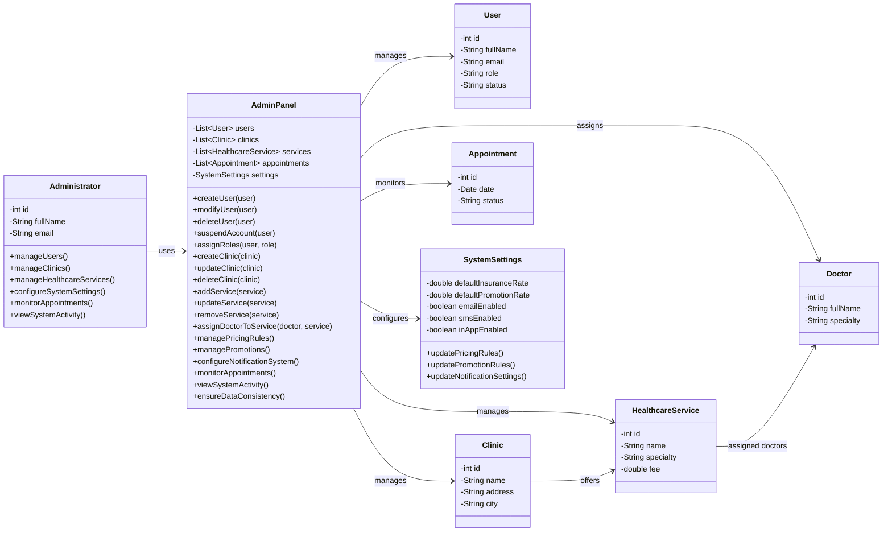

```mermaid
classDiagram
direction LR

class Administrator {
  -int id
  -String fullName
  -String email
  +manageUsers()
  +manageClinics()
  +manageHealthcareServices()
  +configureSystemSettings()
  +monitorAppointments()
  +viewSystemActivity()
}

class AdminPanel {
  -List~User~ users
  -List~Clinic~ clinics
  -List~HealthcareService~ services
  -List~Appointment~ appointments
  -SystemSettings settings
  +createUser(user)
  +modifyUser(user)
  +deleteUser(user)
  +suspendAccount(user)
  +assignRoles(user, role)
  +createClinic(clinic)
  +updateClinic(clinic)
  +deleteClinic(clinic)
  +addService(service)
  +updateService(service)
  +removeService(service)
  +assignDoctorToService(doctor, service)
  +managePricingRules()
  +managePromotions()
  +configureNotificationSystem()
  +monitorAppointments()
  +viewSystemActivity()
  +ensureDataConsistency()
}

class User {
  -int id
  -String fullName
  -String email
  -String role
  -String status
}

class Clinic {
  -int id
  -String name
  -String address
  -String city
}

class HealthcareService {
  -int id
  -String name
  -String specialty
  -double fee
}

class Doctor {
  -int id
  -String fullName
  -String specialty
}

class Appointment {
  -int id
  -Date date
  -String status
}

class SystemSettings {
  -double defaultInsuranceRate
  -double defaultPromotionRate
  -boolean emailEnabled
  -boolean smsEnabled
  -boolean inAppEnabled
  +updatePricingRules()
  +updatePromotionRules()
  +updateNotificationSettings()
}

Administrator --> AdminPanel : uses
AdminPanel --> User : manages
AdminPanel --> Clinic : manages
AdminPanel --> HealthcareService : manages
AdminPanel --> Doctor : assigns
AdminPanel --> Appointment : monitors
AdminPanel --> SystemSettings : configures
Clinic --> HealthcareService : offers
HealthcareService --> Doctor : assigned doctors
```