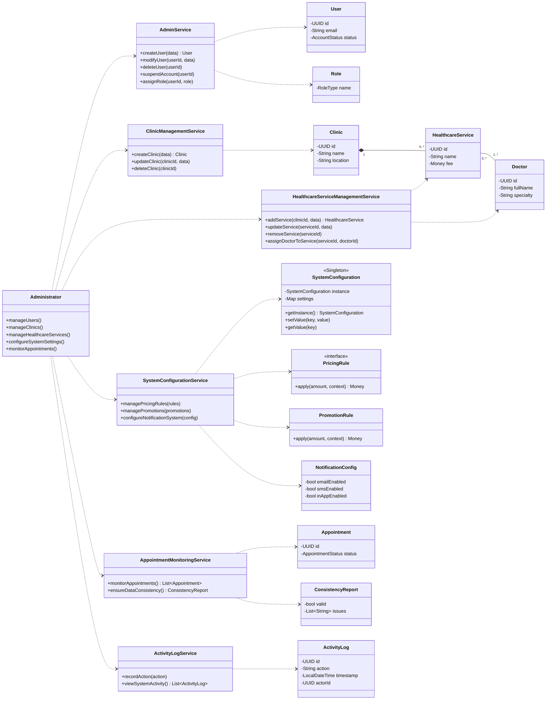

# Applying GRASP/SOLID principles:
The initial AdminPanel had too many responsibilities, so it was split into specialized services.
This improves Single Responsibility and High Cohesion by grouping related operations together.
The Administrator now depends on dedicated controllers, reducing coupling with domain entities.
New domain objects such as Role, PricingRule and ActivityLog make the model more expressive.
These changes make the design easier to maintain, extend and test.
