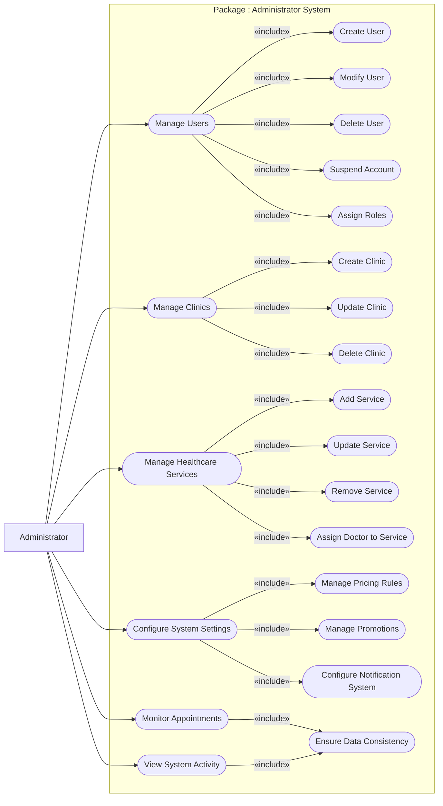

```mermaid
flowchart LR
Administrator[Administrator]

subgraph SystemBoundary[Package : Administrator System]
ManageUsers([Manage Users])
CreateUser([Create User])
ModifyUser([Modify User])
DeleteUser([Delete User])
SuspendAccount([Suspend Account])
AssignRoles([Assign Roles])

ManageClinics([Manage Clinics])
CreateClinic([Create Clinic])
UpdateClinic([Update Clinic])
DeleteClinic([Delete Clinic])

ManageHealthcareServices([Manage Healthcare Services])
AddService([Add Service])
UpdateService([Update Service])
RemoveService([Remove Service])
AssignDoctorToService([Assign Doctor to Service])

ConfigureSystemSettings([Configure System Settings])
ManagePricingRules([Manage Pricing Rules])
ManagePromotions([Manage Promotions])
ConfigureNotificationSystem([Configure Notification System])

MonitorAppointments([Monitor Appointments])
ViewSystemActivity([View System Activity])
EnsureDataConsistency([Ensure Data Consistency])
end

Administrator --> ManageUsers
Administrator --> ManageClinics
Administrator --> ManageHealthcareServices
Administrator --> ConfigureSystemSettings
Administrator --> MonitorAppointments
Administrator --> ViewSystemActivity

ManageUsers -->|"«include»"| CreateUser
ManageUsers -->|"«include»"| ModifyUser
ManageUsers -->|"«include»"| DeleteUser
ManageUsers -->|"«include»"| SuspendAccount
ManageUsers -->|"«include»"| AssignRoles

ManageClinics -->|"«include»"| CreateClinic
ManageClinics -->|"«include»"| UpdateClinic
ManageClinics -->|"«include»"| DeleteClinic

ManageHealthcareServices -->|"«include»"| AddService
ManageHealthcareServices -->|"«include»"| UpdateService
ManageHealthcareServices -->|"«include»"| RemoveService
ManageHealthcareServices -->|"«include»"| AssignDoctorToService

ConfigureSystemSettings -->|"«include»"| ManagePricingRules
ConfigureSystemSettings -->|"«include»"| ManagePromotions
ConfigureSystemSettings -->|"«include»"| ConfigureNotificationSystem

MonitorAppointments -->|"«include»"| EnsureDataConsistency
ViewSystemActivity -->|"«include»"| EnsureDataConsistency
```