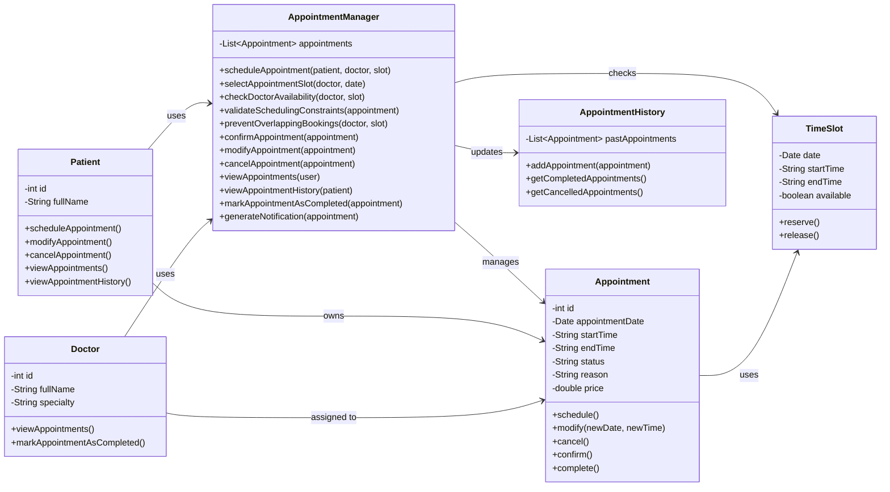

```mermaid
classDiagram
direction LR

class Patient {
  -int id
  -String fullName
  +scheduleAppointment()
  +modifyAppointment()
  +cancelAppointment()
  +viewAppointments()
  +viewAppointmentHistory()
}

class Doctor {
  -int id
  -String fullName
  -String specialty
  +viewAppointments()
  +markAppointmentAsCompleted()
}

class Appointment {
  -int id
  -Date appointmentDate
  -String startTime
  -String endTime
  -String status
  -String reason
  -double price
  +schedule()
  +modify(newDate, newTime)
  +cancel()
  +confirm()
  +complete()
}

class AppointmentManager {
  -List~Appointment~ appointments
  +scheduleAppointment(patient, doctor, slot)
  +selectAppointmentSlot(doctor, date)
  +checkDoctorAvailability(doctor, slot)
  +validateSchedulingConstraints(appointment)
  +preventOverlappingBookings(doctor, slot)
  +confirmAppointment(appointment)
  +modifyAppointment(appointment)
  +cancelAppointment(appointment)
  +viewAppointments(user)
  +viewAppointmentHistory(patient)
  +markAppointmentAsCompleted(appointment)
  +generateNotification(appointment)
}

class AppointmentHistory {
  -List~Appointment~ pastAppointments
  +addAppointment(appointment)
  +getCompletedAppointments()
  +getCancelledAppointments()
}

class TimeSlot {
  -Date date
  -String startTime
  -String endTime
  -boolean available
  +reserve()
  +release()
}

Patient --> AppointmentManager : uses
Doctor --> AppointmentManager : uses
AppointmentManager --> Appointment : manages
AppointmentManager --> TimeSlot : checks
AppointmentManager --> AppointmentHistory : updates
Patient --> Appointment : owns
Doctor --> Appointment : assigned to
Appointment --> TimeSlot : uses
```