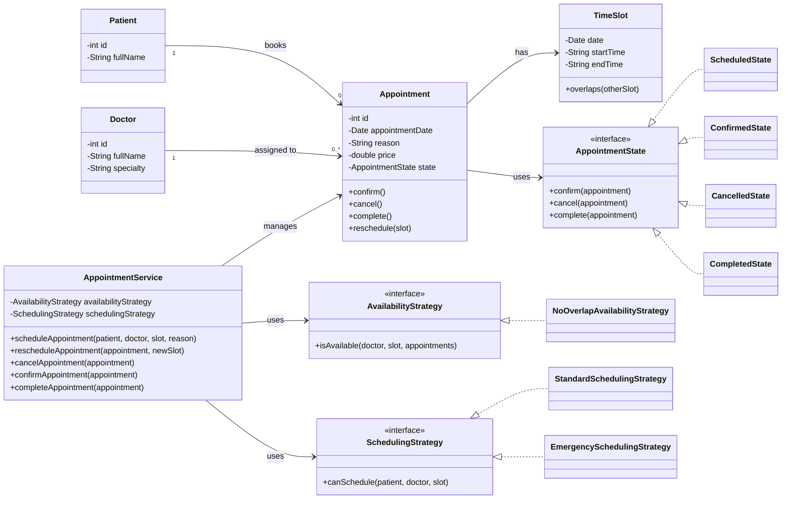

# Applying SOLID/GRASP principles + Strategy and State Pattern:
The design separates responsibilities by moving appointment orchestration from Patient/Doctor to AppointmentService, applying SRP, DIP, and GRASP Controller.
Appointment keeps its own lifecycle behavior, following GRASP Information Expert and High Cohesion.
The State Pattern replaces string-based status handling with state objects to manage valid transitions.
The Strategy Pattern externalizes availability and scheduling rules, supporting OCP and Protected Variations.
This reduces coupling between domain entities and business rules, applying GRASP Low Coupling.
