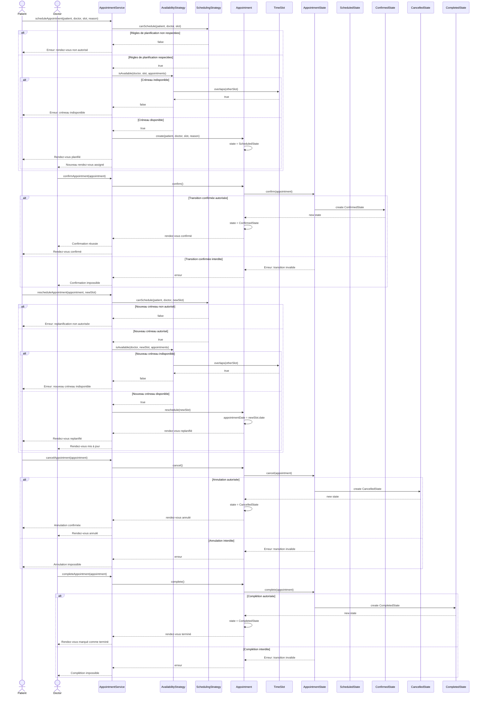

# Sequence diagram of the appointement management system

```mermaid
sequenceDiagram
    actor Patient
    actor Doctor
    participant AppointmentService
    participant AvailabilityStrategy
    participant SchedulingStrategy
    participant Appointment
    participant TimeSlot
    participant State as AppointmentState
    participant ScheduledState
    participant ConfirmedState
    participant CancelledState
    participant CompletedState

    %% Planification d'un rendez-vous
    Patient->>AppointmentService: scheduleAppointment(patient, doctor, slot, reason)

    AppointmentService->>SchedulingStrategy: canSchedule(patient, doctor, slot)

    alt Règles de planification non respectées
        SchedulingStrategy-->>AppointmentService: false
        AppointmentService-->>Patient: Erreur: rendez-vous non autorisé
    else Règles de planification respectées
        SchedulingStrategy-->>AppointmentService: true

        AppointmentService->>AvailabilityStrategy: isAvailable(doctor, slot, appointments)

        alt Créneau indisponible
            AvailabilityStrategy->>TimeSlot: overlaps(otherSlot)
            TimeSlot-->>AvailabilityStrategy: true
            AvailabilityStrategy-->>AppointmentService: false
            AppointmentService-->>Patient: Erreur: créneau indisponible
        else Créneau disponible
            AvailabilityStrategy-->>AppointmentService: true

            AppointmentService->>Appointment: create(patient, doctor, slot, reason)
            Appointment->>Appointment: state = ScheduledState
            AppointmentService-->>Patient: Rendez-vous planifié
            AppointmentService-->>Doctor: Nouveau rendez-vous assigné
        end
    end

    %% Confirmation du rendez-vous via State Pattern
    Doctor->>AppointmentService: confirmAppointment(appointment)
    AppointmentService->>Appointment: confirm()
    Appointment->>State: confirm(appointment)

    alt Transition confirmée autorisée
        State->>ConfirmedState: create ConfirmedState
        ConfirmedState-->>Appointment: new state
        Appointment->>Appointment: state = ConfirmedState
        Appointment-->>AppointmentService: rendez-vous confirmé
        AppointmentService-->>Doctor: Confirmation réussie
        AppointmentService-->>Patient: Rendez-vous confirmé
    else Transition confirmée interdite
        State-->>Appointment: Erreur: transition invalide
        Appointment-->>AppointmentService: erreur
        AppointmentService-->>Doctor: Confirmation impossible
    end

    %% Replanification avec Strategy Pattern
    Patient->>AppointmentService: rescheduleAppointment(appointment, newSlot)

    AppointmentService->>SchedulingStrategy: canSchedule(patient, doctor, newSlot)

    alt Nouveau créneau non autorisé
        SchedulingStrategy-->>AppointmentService: false
        AppointmentService-->>Patient: Erreur: replanification non autorisée
    else Nouveau créneau autorisé
        SchedulingStrategy-->>AppointmentService: true

        AppointmentService->>AvailabilityStrategy: isAvailable(doctor, newSlot, appointments)

        alt Nouveau créneau indisponible
            AvailabilityStrategy->>TimeSlot: overlaps(otherSlot)
            TimeSlot-->>AvailabilityStrategy: true
            AvailabilityStrategy-->>AppointmentService: false
            AppointmentService-->>Patient: Erreur: nouveau créneau indisponible
        else Nouveau créneau disponible
            AvailabilityStrategy-->>AppointmentService: true
            AppointmentService->>Appointment: reschedule(newSlot)
            Appointment->>Appointment: appointmentDate = newSlot.date
            Appointment-->>AppointmentService: rendez-vous replanifié
            AppointmentService-->>Patient: Rendez-vous replanifié
            AppointmentService-->>Doctor: Rendez-vous mis à jour
        end
    end

    %% Annulation via State Pattern
    Patient->>AppointmentService: cancelAppointment(appointment)
    AppointmentService->>Appointment: cancel()
    Appointment->>State: cancel(appointment)

    alt Annulation autorisée
        State->>CancelledState: create CancelledState
        CancelledState-->>Appointment: new state
        Appointment->>Appointment: state = CancelledState
        Appointment-->>AppointmentService: rendez-vous annulé
        AppointmentService-->>Patient: Annulation confirmée
        AppointmentService-->>Doctor: Rendez-vous annulé
    else Annulation interdite
        State-->>Appointment: Erreur: transition invalide
        Appointment-->>AppointmentService: erreur
        AppointmentService-->>Patient: Annulation impossible
    end

    %% Complétion via State Pattern
    Doctor->>AppointmentService: completeAppointment(appointment)
    AppointmentService->>Appointment: complete()
    Appointment->>State: complete(appointment)

    alt Complétion autorisée
        State->>CompletedState: create CompletedState
        CompletedState-->>Appointment: new state
        Appointment->>Appointment: state = CompletedState
        Appointment-->>AppointmentService: rendez-vous terminé
        AppointmentService-->>Doctor: Rendez-vous marqué comme terminé
    else Complétion interdite
        State-->>Appointment: Erreur: transition invalide
        Appointment-->>AppointmentService: erreur
        AppointmentService-->>Doctor: Complétion impossible
    end
```