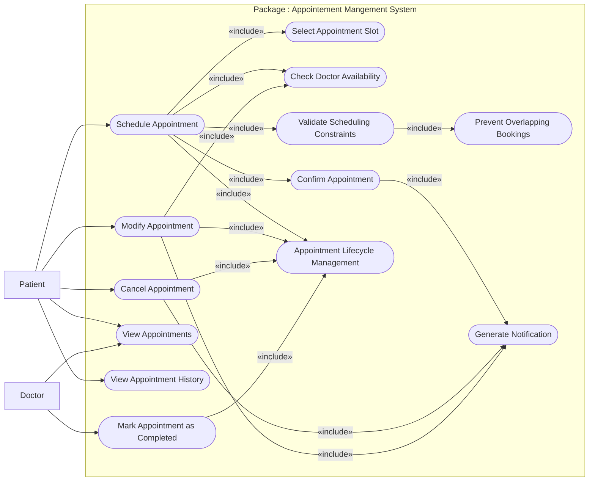

```mermaid
flowchart LR
Patient[Patient]
Doctor[Doctor]

subgraph SystemBoundary[Package : Appointement Mangement System]
ScheduleAppointment([Schedule Appointment])
ModifyAppointment([Modify Appointment])
CancelAppointment([Cancel Appointment])
ViewAppointments([View Appointments])
ViewAppointmentHistory([View Appointment History])
SelectAppointmentSlot([Select Appointment Slot])
CheckDoctorAvailability([Check Doctor Availability])
ValidateSchedulingConstraints([Validate Scheduling Constraints])
PreventOverlappingBookings([Prevent Overlapping Bookings])
ConfirmAppointment([Confirm Appointment])
AppointmentLifecycleManagement([Appointment Lifecycle Management])
MarkAppointmentAsCompleted([Mark Appointment as Completed])
GenerateNotification([Generate Notification])
end

Patient --> ScheduleAppointment
Patient --> ModifyAppointment
Patient --> CancelAppointment
Patient --> ViewAppointments
Patient --> ViewAppointmentHistory

Doctor --> ViewAppointments
Doctor --> MarkAppointmentAsCompleted

ScheduleAppointment -->|"«include»"| CheckDoctorAvailability
ScheduleAppointment -->|"«include»"| SelectAppointmentSlot
ScheduleAppointment -->|"«include»"| ValidateSchedulingConstraints
ValidateSchedulingConstraints -->|"«include»"| PreventOverlappingBookings
ScheduleAppointment -->|"«include»"| ConfirmAppointment
ConfirmAppointment -->|"«include»"| GenerateNotification

CancelAppointment -->|"«include»"| GenerateNotification
ModifyAppointment -->|"«include»"| CheckDoctorAvailability
ModifyAppointment -->|"«include»"| GenerateNotification

ScheduleAppointment -->|"«include»"| AppointmentLifecycleManagement
ModifyAppointment -->|"«include»"| AppointmentLifecycleManagement
CancelAppointment -->|"«include»"| AppointmentLifecycleManagement
MarkAppointmentAsCompleted -->|"«include»"| AppointmentLifecycleManagement
```