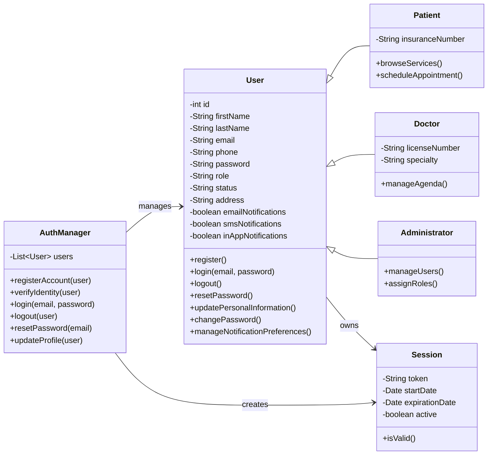

```mermaid
classDiagram
direction LR

class User {
  -int id
  -String firstName
  -String lastName
  -String email
  -String phone
  -String password
  -String role
  -String status
  -String address
  -boolean emailNotifications
  -boolean smsNotifications
  -boolean inAppNotifications
  +register()
  +login(email, password)
  +logout()
  +resetPassword()
  +updatePersonalInformation()
  +changePassword()
  +manageNotificationPreferences()
}

class Patient {
  -String insuranceNumber
  +browseServices()
  +scheduleAppointment()
}

class Doctor {
  -String licenseNumber
  -String specialty
  +manageAgenda()
}

class Administrator {
  +manageUsers()
  +assignRoles()
}

class AuthManager {
  -List~User~ users
  +registerAccount(user)
  +verifyIdentity(user)
  +login(email, password)
  +logout(user)
  +resetPassword(email)
  +updateProfile(user)
}

class Session {
  -String token
  -Date startDate
  -Date expirationDate
  -boolean active
  +isValid()
}

User <|-- Patient
User <|-- Doctor
User <|-- Administrator
AuthManager --> User : manages
AuthManager --> Session : creates
User --> Session : owns
```
