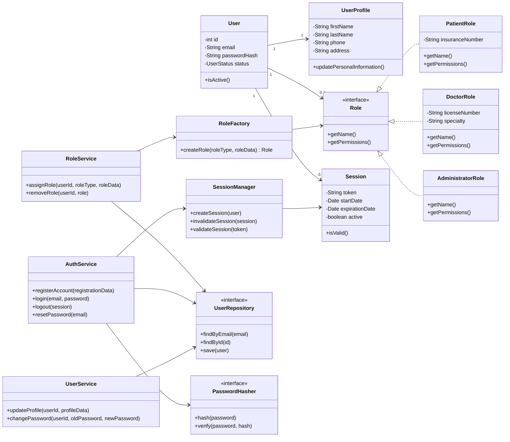

# Applying SOLID/GRASP principles + factory pattern:
The model was refactored by moving authentication, profile management, session handling and role assignment out of User, applying SOLID SRP and GRASP High Cohesion.
Inheritance between User, Patient, Doctor and Administrator was replaced by a Role abstraction, improving SOLID OCP/LSP and GRASP Low Coupling.
Repositories and interfaces such as UserRepository and PasswordHasher were introduced to respect SOLID DIP and GRASP Protected Variations.
Responsibilities were assigned to the classes that own the right information, following GRASP Information Expert.
A Factory Method was added through RoleFactory to centralize role creation without modifying client services.

