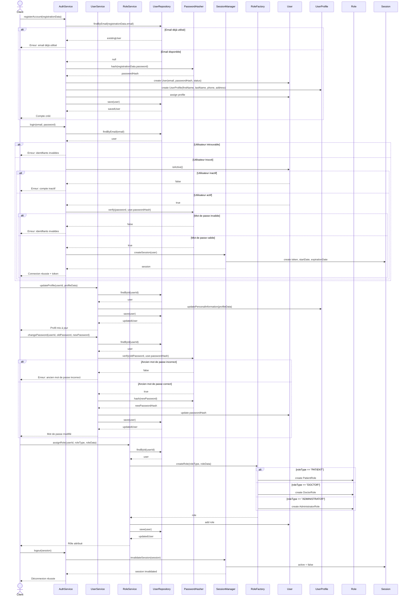

# Sequence diagram of the user authenfication and profile management system

```mermaid
sequenceDiagram
    actor Client
    participant AuthService
    participant UserService
    participant RoleService
    participant UserRepository
    participant PasswordHasher
    participant SessionManager
    participant RoleFactory
    participant User
    participant UserProfile
    participant Role
    participant Session

    %% Inscription d'un compte
    Client->>AuthService: registerAccount(registrationData)
    AuthService->>UserRepository: findByEmail(registrationData.email)

    alt Email déjà utilisé
        UserRepository-->>AuthService: existingUser
        AuthService-->>Client: Erreur: email déjà utilisé
    else Email disponible
        UserRepository-->>AuthService: null
        AuthService->>PasswordHasher: hash(registrationData.password)
        PasswordHasher-->>AuthService: passwordHash

        AuthService->>User: create User(email, passwordHash, status)
        AuthService->>UserProfile: create UserProfile(firstName, lastName, phone, address)
        AuthService->>User: assign profile
        AuthService->>UserRepository: save(user)
        UserRepository-->>AuthService: savedUser

        AuthService-->>Client: Compte créé
    end

    %% Connexion
    Client->>AuthService: login(email, password)
    AuthService->>UserRepository: findByEmail(email)
    UserRepository-->>AuthService: user

    alt Utilisateur introuvable
        AuthService-->>Client: Erreur: identifiants invalides
    else Utilisateur trouvé
        AuthService->>User: isActive()

        alt Utilisateur inactif
            User-->>AuthService: false
            AuthService-->>Client: Erreur: compte inactif
        else Utilisateur actif
            User-->>AuthService: true
            AuthService->>PasswordHasher: verify(password, user.passwordHash)

            alt Mot de passe invalide
                PasswordHasher-->>AuthService: false
                AuthService-->>Client: Erreur: identifiants invalides
            else Mot de passe valide
                PasswordHasher-->>AuthService: true
                AuthService->>SessionManager: createSession(user)
                SessionManager->>Session: create token, startDate, expirationDate
                SessionManager-->>AuthService: session
                AuthService-->>Client: Connexion réussie + token
            end
        end
    end

    %% Mise à jour du profil
    Client->>UserService: updateProfile(userId, profileData)
    UserService->>UserRepository: findById(userId)
    UserRepository-->>UserService: user
    UserService->>UserProfile: updatePersonalInformation(profileData)
    UserService->>UserRepository: save(user)
    UserRepository-->>UserService: updatedUser
    UserService-->>Client: Profil mis à jour

    %% Changement de mot de passe
    Client->>UserService: changePassword(userId, oldPassword, newPassword)
    UserService->>UserRepository: findById(userId)
    UserRepository-->>UserService: user
    UserService->>PasswordHasher: verify(oldPassword, user.passwordHash)

    alt Ancien mot de passe incorrect
        PasswordHasher-->>UserService: false
        UserService-->>Client: Erreur: ancien mot de passe incorrect
    else Ancien mot de passe correct
        PasswordHasher-->>UserService: true
        UserService->>PasswordHasher: hash(newPassword)
        PasswordHasher-->>UserService: newPasswordHash
        UserService->>User: update passwordHash
        UserService->>UserRepository: save(user)
        UserRepository-->>UserService: updatedUser
        UserService-->>Client: Mot de passe modifié
    end

    %% Attribution d'un rôle
    Client->>RoleService: assignRole(userId, roleType, roleData)
    RoleService->>UserRepository: findById(userId)
    UserRepository-->>RoleService: user
    RoleService->>RoleFactory: createRole(roleType, roleData)

    alt roleType == "PATIENT"
        RoleFactory->>Role: create PatientRole
    else roleType == "DOCTOR"
        RoleFactory->>Role: create DoctorRole
    else roleType == "ADMINISTRATOR"
        RoleFactory->>Role: create AdministratorRole
    end

    RoleFactory-->>RoleService: role
    RoleService->>User: add role
    RoleService->>UserRepository: save(user)
    UserRepository-->>RoleService: updatedUser
    RoleService-->>Client: Rôle attribué

    %% Déconnexion
    Client->>AuthService: logout(session)
    AuthService->>SessionManager: invalidateSession(session)
    SessionManager->>Session: active = false
    SessionManager-->>AuthService: session invalidated
    AuthService-->>Client: Déconnexion réussie
```