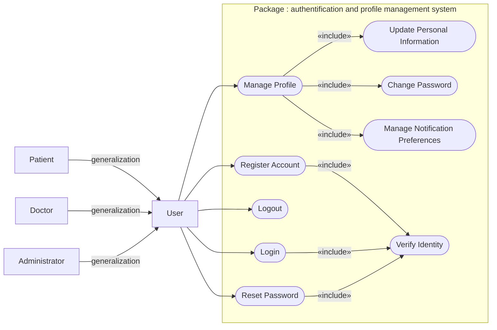

```mermaid
flowchart LR
User[User]
Patient[Patient]
Doctor[Doctor]
Administrator[Administrator]

Patient -->|"generalization"| User
Doctor -->|"generalization"| User
Administrator -->|"generalization"| User

subgraph SystemBoundary[Package : authentification and profile management system]
RegisterAccount([Register Account])
Login([Login])
Logout([Logout])
ResetPassword([Reset Password])
ManageProfile([Manage Profile])
UpdatePersonalInformation([Update Personal Information])
ChangePassword([Change Password])
ManageNotificationPreferences([Manage Notification Preferences])
VerifyIdentity([Verify Identity])
end

User --> RegisterAccount
User --> Login
User --> Logout
User --> ResetPassword
User --> ManageProfile

RegisterAccount -->|"«include»"| VerifyIdentity
Login -->|"«include»"| VerifyIdentity
ResetPassword -->|"«include»"| VerifyIdentity

ManageProfile -->|"«include»"| UpdatePersonalInformation
ManageProfile -->|"«include»"| ChangePassword
ManageProfile -->|"«include»"| ManageNotificationPreferences
```