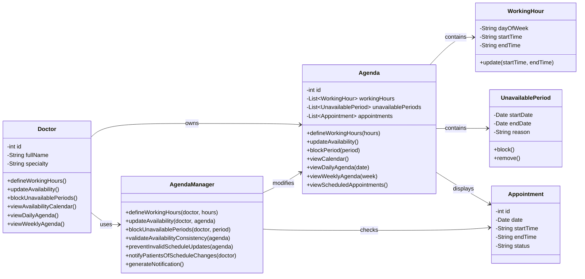

```mermaid
classDiagram
direction LR

class Doctor {
  -int id
  -String fullName
  -String specialty
  +defineWorkingHours()
  +updateAvailability()
  +blockUnavailablePeriods()
  +viewAvailabilityCalendar()
  +viewDailyAgenda()
  +viewWeeklyAgenda()
}

class Agenda {
  -int id
  -List~WorkingHour~ workingHours
  -List~UnavailablePeriod~ unavailablePeriods
  -List~Appointment~ appointments
  +defineWorkingHours(hours)
  +updateAvailability()
  +blockPeriod(period)
  +viewCalendar()
  +viewDailyAgenda(date)
  +viewWeeklyAgenda(week)
  +viewScheduledAppointments()
}

class WorkingHour {
  -String dayOfWeek
  -String startTime
  -String endTime
  +update(startTime, endTime)
}

class UnavailablePeriod {
  -Date startDate
  -Date endDate
  -String reason
  +block()
  +remove()
}

class Appointment {
  -int id
  -Date date
  -String startTime
  -String endTime
  -String status
}

class AgendaManager {
  +defineWorkingHours(doctor, hours)
  +updateAvailability(doctor, agenda)
  +blockUnavailablePeriods(doctor, period)
  +validateAvailabilityConsistency(agenda)
  +preventInvalidScheduleUpdates(agenda)
  +notifyPatientsOfScheduleChanges(doctor)
  +generateNotification()
}

Doctor --> Agenda : owns
Agenda --> WorkingHour : contains
Agenda --> UnavailablePeriod : contains
Agenda --> Appointment : displays
Doctor --> AgendaManager : uses
AgendaManager --> Agenda : modifies
AgendaManager --> Appointment : checks
```