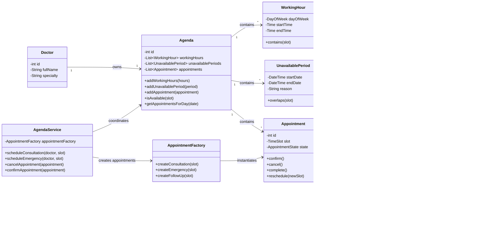

# Applying SOLID/GRASP Principles + Strategy and State Patterns:
The design applies SRP by moving agenda-related behavior out of Doctor and keeping each class focused on one responsibility.
Using GRASP Expert, availability checks are handled by Agenda, WorkingHour, and UnavailablePeriod, since they own the required information.
AgendaService acts as a GRASP Controller, coordinating use cases without holding all business rules.
The Factory Pattern centralizes appointment creation, supporting OCP when adding new appointment types.
The State Pattern moves appointment status behavior into state classes, improving cohesion and reducing conditional logic
