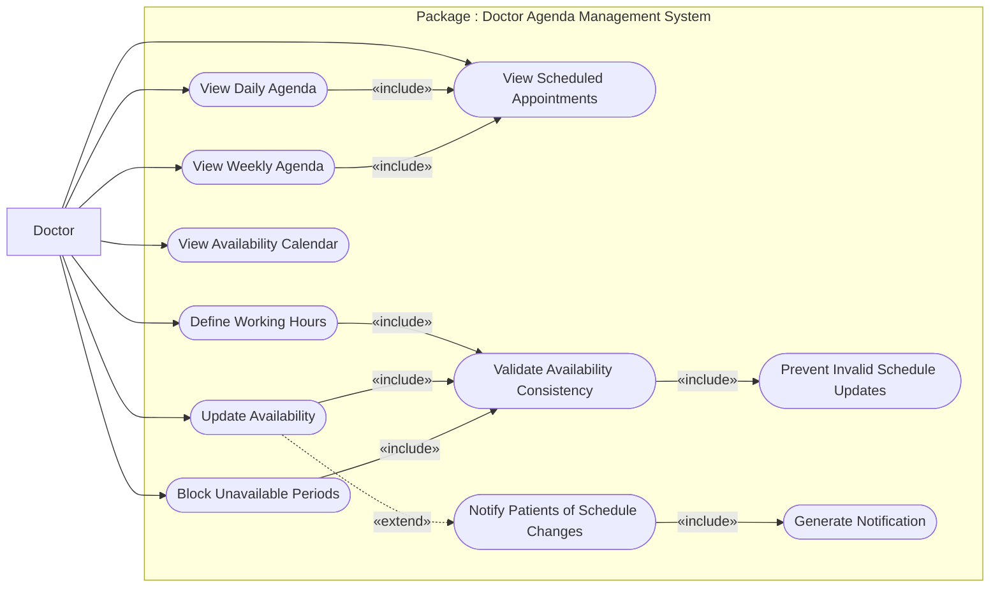

```mermaid
flowchart LR
Doctor[Doctor]

subgraph SystemBoundary[Package : Doctor Agenda Management System]
DefineWorkingHours([Define Working Hours])
UpdateAvailability([Update Availability])
BlockUnavailablePeriods([Block Unavailable Periods])
ViewAvailabilityCalendar([View Availability Calendar])
ViewDailyAgenda([View Daily Agenda])
ViewWeeklyAgenda([View Weekly Agenda])
ViewScheduledAppointments([View Scheduled Appointments])
ValidateAvailabilityConsistency([Validate Availability Consistency])
PreventInvalidScheduleUpdates([Prevent Invalid Schedule Updates])
NotifyPatientsOfScheduleChanges([Notify Patients of Schedule Changes])
GenerateNotification([Generate Notification])
end

Doctor --> DefineWorkingHours
Doctor --> UpdateAvailability
Doctor --> BlockUnavailablePeriods
Doctor --> ViewAvailabilityCalendar
Doctor --> ViewDailyAgenda
Doctor --> ViewWeeklyAgenda
Doctor --> ViewScheduledAppointments

DefineWorkingHours -->|"«include»"| ValidateAvailabilityConsistency
UpdateAvailability -->|"«include»"| ValidateAvailabilityConsistency
BlockUnavailablePeriods -->|"«include»"| ValidateAvailabilityConsistency

ValidateAvailabilityConsistency -->|"«include»"| PreventInvalidScheduleUpdates
UpdateAvailability -.->|"«extend»"| NotifyPatientsOfScheduleChanges
NotifyPatientsOfScheduleChanges -->|"«include»"| GenerateNotification

ViewDailyAgenda -->|"«include»"| ViewScheduledAppointments
ViewWeeklyAgenda -->|"«include»"| ViewScheduledAppointments

```