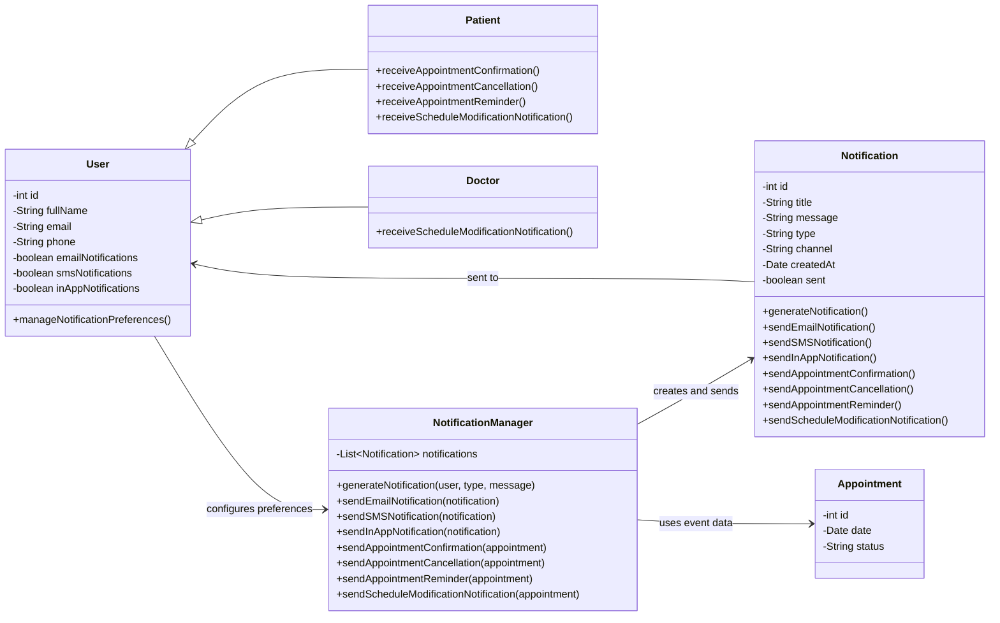

```mermaid
classDiagram
direction LR

class User {
  -int id
  -String fullName
  -String email
  -String phone
  -boolean emailNotifications
  -boolean smsNotifications
  -boolean inAppNotifications
  +manageNotificationPreferences()
}

class Patient {
  +receiveAppointmentConfirmation()
  +receiveAppointmentCancellation()
  +receiveAppointmentReminder()
  +receiveScheduleModificationNotification()
}

class Doctor {
  +receiveScheduleModificationNotification()
}

class Notification {
  -int id
  -String title
  -String message
  -String type
  -String channel
  -Date createdAt
  -boolean sent
  +generateNotification()
  +sendEmailNotification()
  +sendSMSNotification()
  +sendInAppNotification()
  +sendAppointmentConfirmation()
  +sendAppointmentCancellation()
  +sendAppointmentReminder()
  +sendScheduleModificationNotification()
}

class NotificationManager {
  -List~Notification~ notifications
  +generateNotification(user, type, message)
  +sendEmailNotification(notification)
  +sendSMSNotification(notification)
  +sendInAppNotification(notification)
  +sendAppointmentConfirmation(appointment)
  +sendAppointmentCancellation(appointment)
  +sendAppointmentReminder(appointment)
  +sendScheduleModificationNotification(appointment)
}

class Appointment {
  -int id
  -Date date
  -String status
}

User <|-- Patient
User <|-- Doctor
User --> NotificationManager : configures preferences
NotificationManager --> Notification : creates and sends
NotificationManager --> Appointment : uses event data
Notification --> User : sent to
```