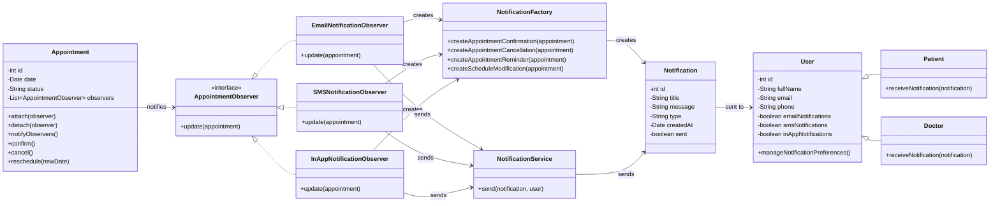

# Notification System afer applying SOLID/GRASP + Observer pattern:
The original design was modified to make the notification system more modular, maintainable, and easier to extend. The Notification class was simplified so that it only represents notification data, instead of also generating and sending notifications. This follows the Single Responsibility Principle (SRP), because each class now has one clear responsibility.

An Observer pattern was added with Appointment as the subject and notification observers such as EmailNotificationObserver, SMSNotificationObserver, and InAppNotificationObserver. When an appointment is confirmed, cancelled, or rescheduled, the appointment notifies its observers automatically. This improves low coupling from GRASP, because Appointment does not need to know the concrete details of each notification channel.

The design also follows the Open/Closed Principle (OCP), since adding a new notification channel, such as WhatsApp, only requires creating a new observer class without modifying the existing appointment logic. Finally, the use of the AppointmentObserver interface supports the Dependency Inversion Principle (DIP), because the appointment depends on an abstraction rather than concrete notification classes.
