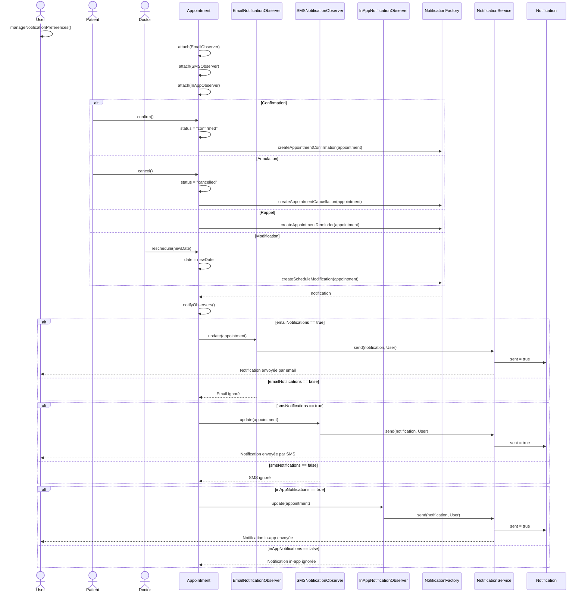

# Sequence diagram of the notification system

```mermaid
sequenceDiagram
    actor User
    actor Patient
    actor Doctor
    participant Appointment
    participant EmailObserver as EmailNotificationObserver
    participant SMSObserver as SMSNotificationObserver
    participant InAppObserver as InAppNotificationObserver
    participant Factory as NotificationFactory
    participant Service as NotificationService
    participant Notification

    User->>User: manageNotificationPreferences()

    Appointment->>Appointment: attach(EmailObserver)
    Appointment->>Appointment: attach(SMSObserver)
    Appointment->>Appointment: attach(InAppObserver)

    alt Confirmation
        Patient->>Appointment: confirm()
        Appointment->>Appointment: status = "confirmed"
        Appointment->>Factory: createAppointmentConfirmation(appointment)
    else Annulation
        Patient->>Appointment: cancel()
        Appointment->>Appointment: status = "cancelled"
        Appointment->>Factory: createAppointmentCancellation(appointment)
    else Rappel
        Appointment->>Factory: createAppointmentReminder(appointment)
    else Modification
        Doctor->>Appointment: reschedule(newDate)
        Appointment->>Appointment: date = newDate
        Appointment->>Factory: createScheduleModification(appointment)
    end

    Factory-->>Appointment: notification
    Appointment->>Appointment: notifyObservers()

    alt emailNotifications == true
        Appointment->>EmailObserver: update(appointment)
        EmailObserver->>Service: send(notification, User)
        Service->>Notification: sent = true
        Service-->>User: Notification envoyée par email
    else emailNotifications == false
        EmailObserver-->>Appointment: Email ignoré
    end

    alt smsNotifications == true
        Appointment->>SMSObserver: update(appointment)
        SMSObserver->>Service: send(notification, User)
        Service->>Notification: sent = true
        Service-->>User: Notification envoyée par SMS
    else smsNotifications == false
        SMSObserver-->>Appointment: SMS ignoré
    end

    alt inAppNotifications == true
        Appointment->>InAppObserver: update(appointment)
        InAppObserver->>Service: send(notification, User)
        Service->>Notification: sent = true
        Service-->>User: Notification in-app envoyée
    else inAppNotifications == false
        InAppObserver-->>Appointment: Notification in-app ignorée
    end
```