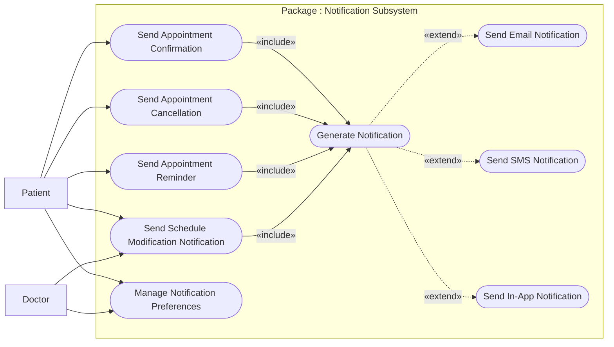

```mermaid
flowchart LR
Patient[Patient]
Doctor[Doctor]

subgraph SystemBoundary[Package : Notification Subsystem]
GenerateNotification([Generate Notification])
SendEmailNotification([Send Email Notification])
SendSMSNotification([Send SMS Notification])
SendInAppNotification([Send In-App Notification])
SendAppointmentConfirmation([Send Appointment Confirmation])
SendAppointmentCancellation([Send Appointment Cancellation])
SendAppointmentReminder([Send Appointment Reminder])
SendScheduleModificationNotification([Send Schedule Modification Notification])
ManageNotificationPreferences([Manage Notification Preferences])
end

Patient --> SendAppointmentConfirmation
Patient --> SendAppointmentCancellation
Patient --> SendAppointmentReminder
Patient --> SendScheduleModificationNotification
Patient --> ManageNotificationPreferences

Doctor --> SendScheduleModificationNotification
Doctor --> ManageNotificationPreferences


SendAppointmentConfirmation -->|"«include»"| GenerateNotification
SendAppointmentCancellation -->|"«include»"| GenerateNotification
SendAppointmentReminder -->|"«include»"| GenerateNotification
SendScheduleModificationNotification -->|"«include»"| GenerateNotification

GenerateNotification -.->|"«extend»"| SendEmailNotification
GenerateNotification -.->|"«extend»"| SendSMSNotification
GenerateNotification -.->|"«extend»"| SendInAppNotification
```