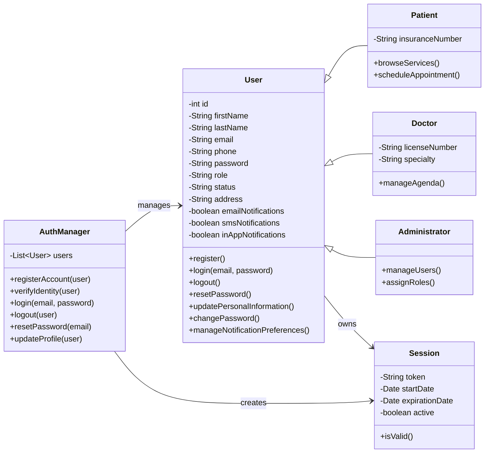
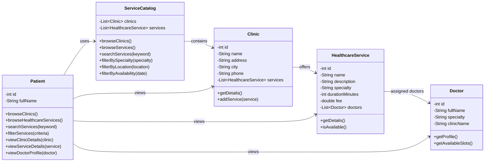
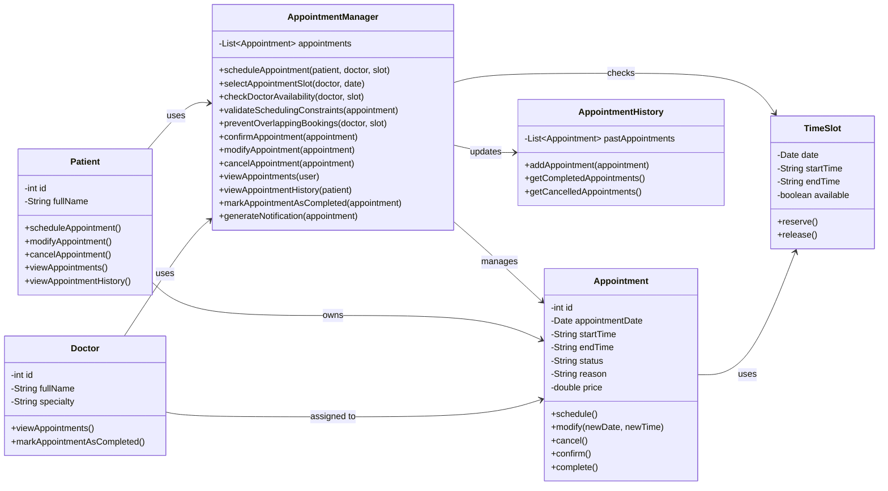
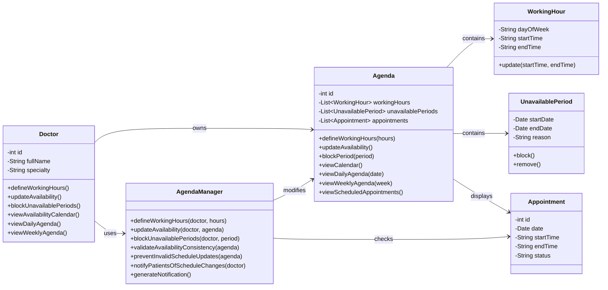
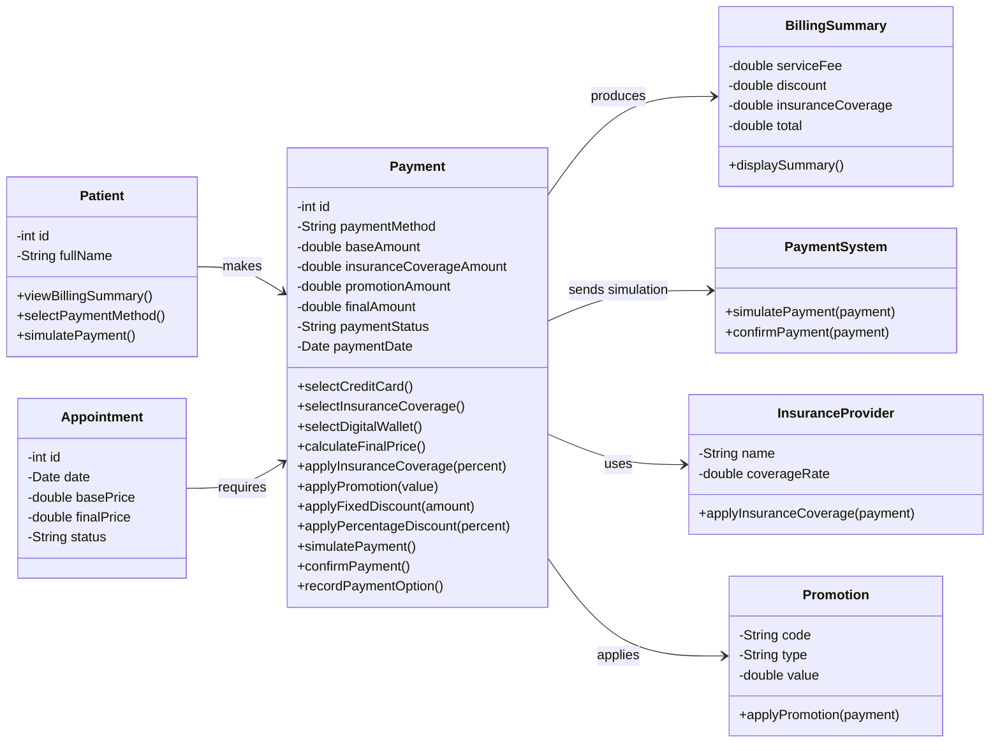
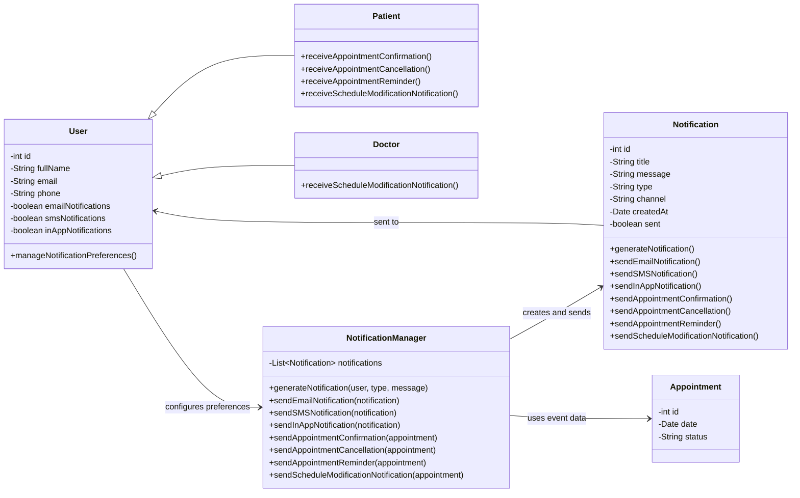
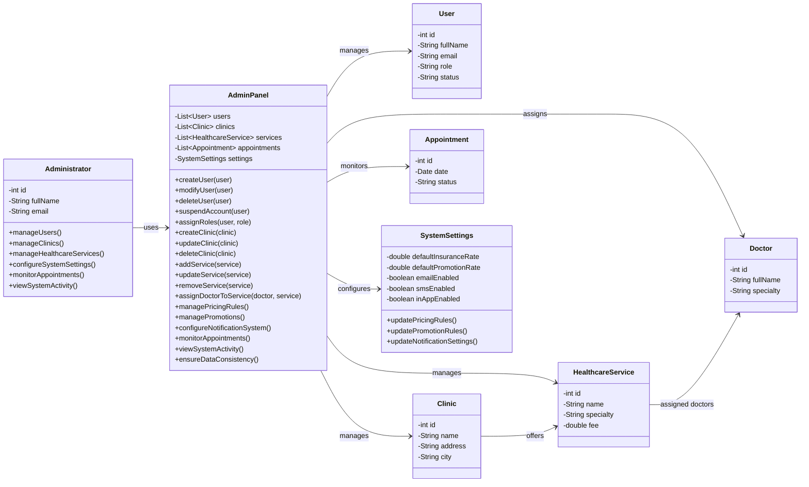
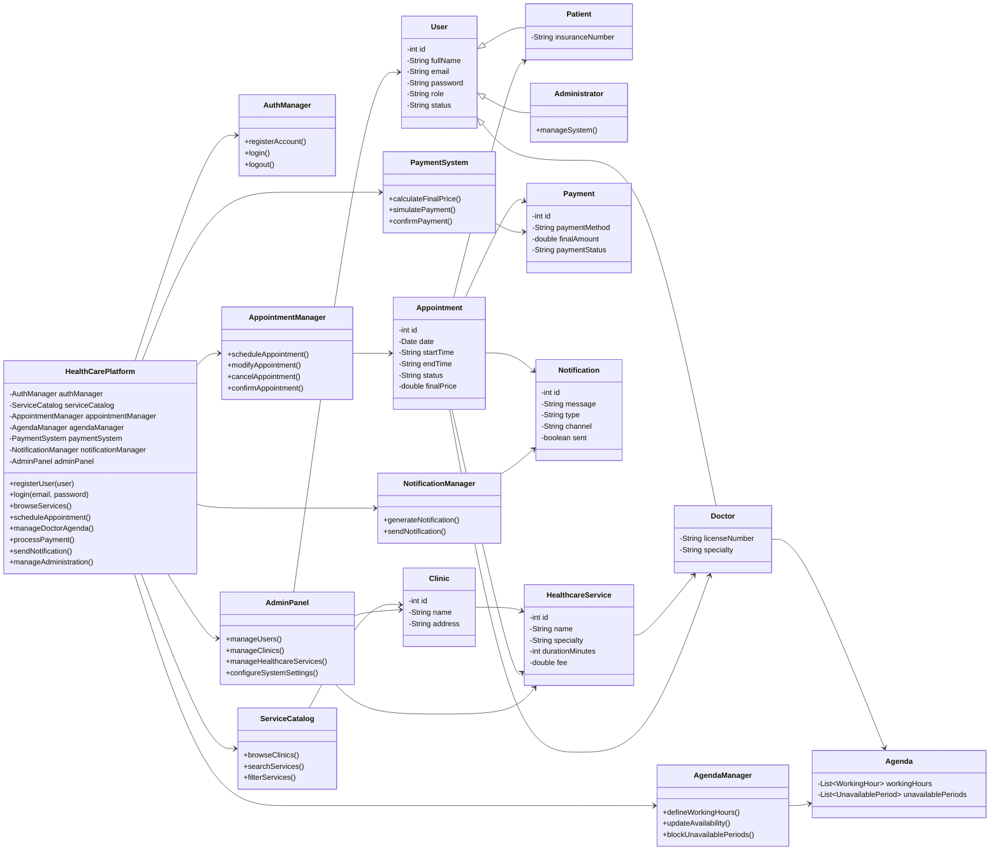

# Diagrammes de classes Mermaid minimalistes — version AVANT SOLID/GRASP

Ces diagrammes représentent une version volontairement plus simple et plus directe du système **HealthCare Appointment Management System**, construite à partir des use-cases originaux.

Objectif : fournir une base “avant refactoring” pour comparer avec une version améliorée appliquant SOLID, GRASP et des design patterns.

Cette version reste cohérente fonctionnellement, mais elle ne cherche pas à optimiser l’architecture. Les responsabilités sont parfois regroupées dans des classes de gestion générales, les dépendances sont plus directes, et aucun pattern comme Strategy, Factory, Observer ou Singleton n’est introduit.

---

## 1. Package : Authentification and Profile Management System

---

## 2. Package : Patient Service Viewer System

---

## 3. Package : Appointment Management System

---

## 4. Package : Doctor Agenda Management System

---

## 5. Package : Paiement System

---

## 6. Package : Notification Subsystem

---

## 7. Package : Administrator System

---

## 8. Vue globale simplifiée — avant SOLID/GRASP

---

## Commentaire pour le rapport : limites volontaires de cette version

Cette version peut être utilisée comme **modèle initial avant amélioration**. Elle est correcte pour représenter les concepts métier principaux, mais elle présente volontairement plusieurs limites architecturales :

- Les classes `Manager` concentrent beaucoup de responsabilités.
- Les opérations métier sont souvent placées directement dans les entités.
- Les dépendances sont directes entre modules.
- Les variantes de paiement, de notification ou de promotion ne sont pas isolées dans des abstractions.
- Il n’y a pas de design pattern explicite.
- L’extension du système demanderait souvent de modifier les classes existantes.

Ces limites permettront de justifier clairement la version “après” basée sur SOLID, GRASP et les design patterns.
