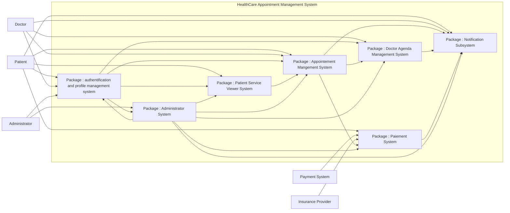

```mermaid
flowchart LR

%% =======================
%% ACTEURS
%% =======================

Patient[Patient]
Doctor[Doctor]
Administrator[Administrator]
PaymentSystem[Payment System]
InsuranceProvider[Insurance Provider]


%% =======================
%% SYSTÈME GÉNÉRAL
%% =======================

subgraph GENERAL["HealthCare Appointment Management System"]

    AUTH["Package : authentification and profile management system"]

    PATIENT_SERVICE["Package : Patient Service Viewer System"]

    APPOINTMENT["Package : Appointement Mangement System"]

    DOCTOR_AGENDA["Package : Doctor Agenda Management System"]

    PAYMENT["Package : Paiement System"]

    NOTIFICATION["Package : Notification Subsystem"]

    ADMIN["Package : Administrator System"]

end


%% =======================
%% LIENS ACTEURS → PACKAGES
%% =======================

Patient --> AUTH
Patient --> PATIENT_SERVICE
Patient --> APPOINTMENT
Patient --> PAYMENT
Patient --> NOTIFICATION

Doctor --> AUTH
Doctor --> APPOINTMENT
Doctor --> DOCTOR_AGENDA
Doctor --> NOTIFICATION

Administrator --> AUTH
Administrator --> ADMIN

PaymentSystem --> PAYMENT
InsuranceProvider --> PAYMENT


%% =======================
%% LIENS ENTRE PACKAGES
%% =======================

AUTH --> PATIENT_SERVICE
AUTH --> APPOINTMENT
AUTH --> DOCTOR_AGENDA
AUTH --> ADMIN

PATIENT_SERVICE --> APPOINTMENT

APPOINTMENT --> DOCTOR_AGENDA
APPOINTMENT --> PAYMENT
APPOINTMENT --> NOTIFICATION

DOCTOR_AGENDA --> NOTIFICATION

PAYMENT --> NOTIFICATION

ADMIN --> AUTH
ADMIN --> PATIENT_SERVICE
ADMIN --> APPOINTMENT
ADMIN --> DOCTOR_AGENDA
ADMIN --> PAYMENT
ADMIN --> NOTIFICATION
```