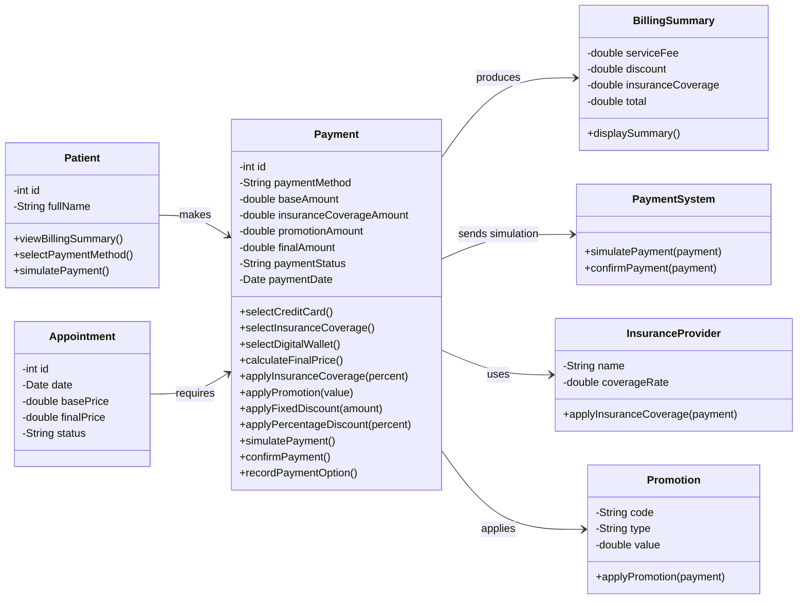

```mermaid
classDiagram
direction LR

class Patient {
  -int id
  -String fullName
  +viewBillingSummary()
  +selectPaymentMethod()
  +simulatePayment()
}

class Appointment {
  -int id
  -Date date
  -double basePrice
  -double finalPrice
  -String status
}

class Payment {
  -int id
  -String paymentMethod
  -double baseAmount
  -double insuranceCoverageAmount
  -double promotionAmount
  -double finalAmount
  -String paymentStatus
  -Date paymentDate
  +selectCreditCard()
  +selectInsuranceCoverage()
  +selectDigitalWallet()
  +calculateFinalPrice()
  +applyInsuranceCoverage(percent)
  +applyPromotion(value)
  +applyFixedDiscount(amount)
  +applyPercentageDiscount(percent)
  +simulatePayment()
  +confirmPayment()
  +recordPaymentOption()
}

class BillingSummary {
  -double serviceFee
  -double discount
  -double insuranceCoverage
  -double total
  +displaySummary()
}

class PaymentSystem {
  +simulatePayment(payment)
  +confirmPayment(payment)
}

class InsuranceProvider {
  -String name
  -double coverageRate
  +applyInsuranceCoverage(payment)
}

class Promotion {
  -String code
  -String type
  -double value
  +applyPromotion(payment)
}

Patient --> Payment : makes
Appointment --> Payment : requires
Payment --> BillingSummary : produces
Payment --> PaymentSystem : sends simulation
Payment --> InsuranceProvider : uses
Payment --> Promotion : applies
```