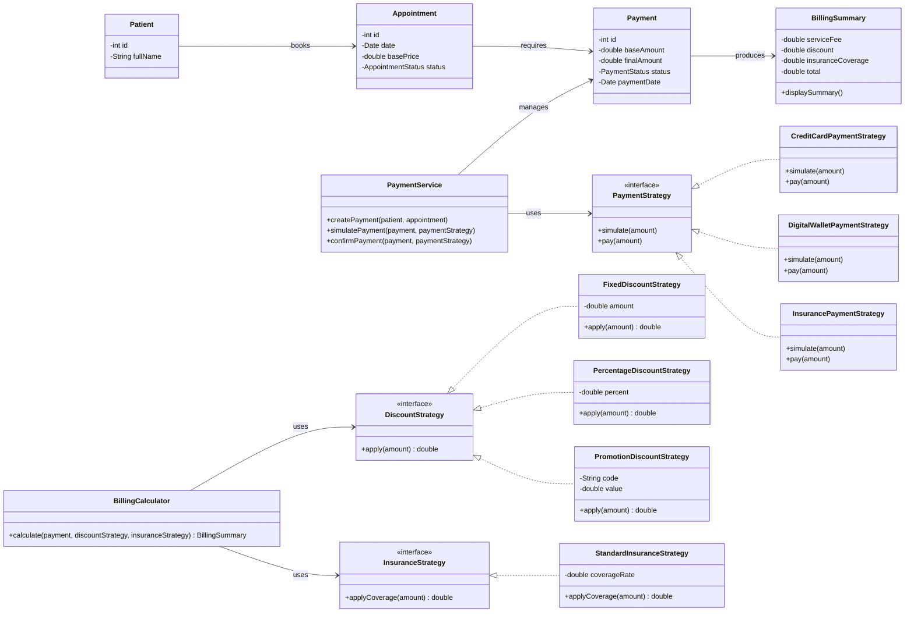

# Applying SOLID/GRASP principles = Strategy pattern:
The payment logic was removed from Patient and Payment to respect Single Responsibility and improve cohesion.
PaymentService now acts as a GRASP Controller that coordinates the payment process.
BillingCalculator is responsible for computing the final amount using dedicated strategies.
The Strategy Pattern is applied to payment methods, discounts, and insurance coverage to support polymorphism.
This makes the design easier to extend without modifying existing classes, respecting the Open/Closed Principle.
