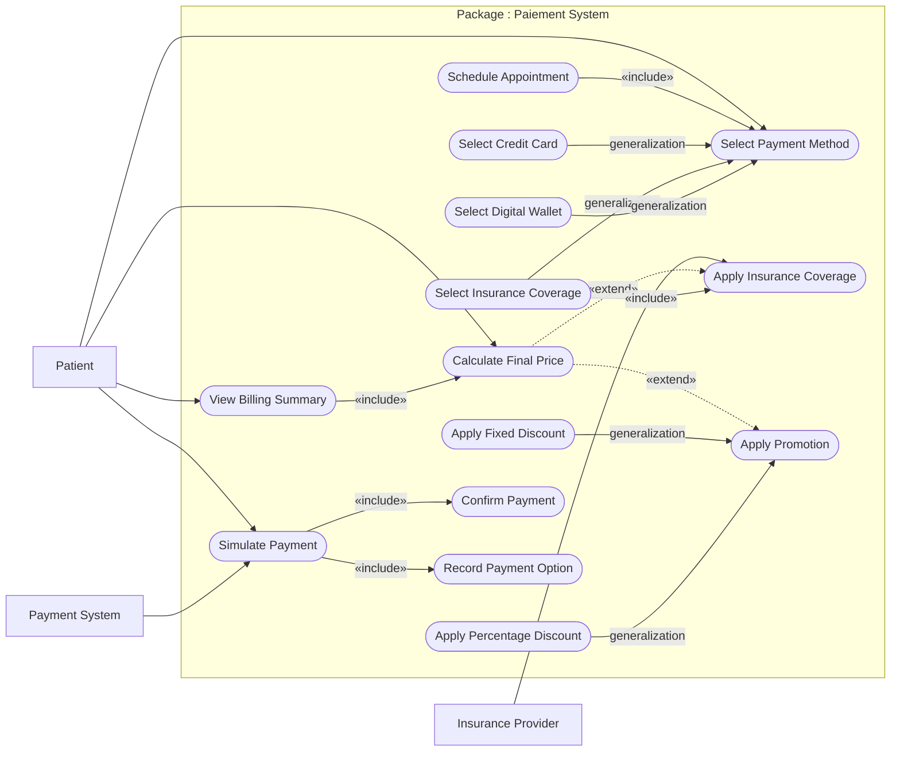

```mermaid
flowchart LR
Patient[Patient]
PaymentSystem[Payment System]
InsuranceProvider[Insurance Provider]

subgraph SystemBoundary[Package : Paiement System]
ScheduleAppointment([Schedule Appointment])
ViewBillingSummary([View Billing Summary])
SelectPaymentMethod([Select Payment Method])
SelectCreditCard([Select Credit Card])
SelectInsuranceCoverage([Select Insurance Coverage])
SelectDigitalWallet([Select Digital Wallet])
CalculateFinalPrice([Calculate Final Price])
ApplyInsuranceCoverage([Apply Insurance Coverage])
ApplyPromotion([Apply Promotion])
ApplyFixedDiscount([Apply Fixed Discount])
ApplyPercentageDiscount([Apply Percentage Discount])
SimulatePayment([Simulate Payment])
ConfirmPayment([Confirm Payment])
RecordPaymentOption([Record Payment Option])
end

Patient --> ViewBillingSummary
Patient --> SelectPaymentMethod
Patient --> CalculateFinalPrice
Patient --> SimulatePayment

PaymentSystem --> SimulatePayment
InsuranceProvider --> ApplyInsuranceCoverage

ScheduleAppointment -->|"«include»"| SelectPaymentMethod
ViewBillingSummary -->|"«include»"| CalculateFinalPrice

SelectCreditCard -->|"generalization"| SelectPaymentMethod
SelectInsuranceCoverage -->|"generalization"| SelectPaymentMethod
SelectDigitalWallet -->|"generalization"| SelectPaymentMethod

CalculateFinalPrice -.->|"«extend»"| ApplyInsuranceCoverage
CalculateFinalPrice -.->|"«extend»"| ApplyPromotion

ApplyFixedDiscount -->|"generalization"| ApplyPromotion
ApplyPercentageDiscount -->|"generalization"| ApplyPromotion

SimulatePayment -->|"«include»"| RecordPaymentOption
SimulatePayment -->|"«include»"| ConfirmPayment
SelectInsuranceCoverage -->|"«include»"| ApplyInsuranceCoverage
```