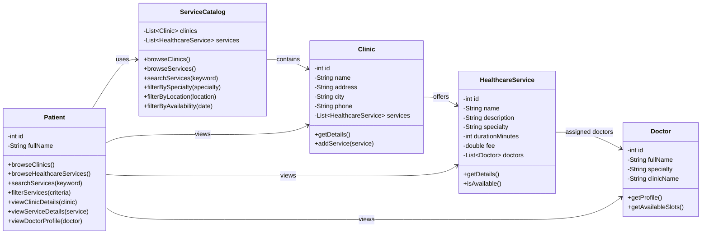

```mermaid
classDiagram
direction LR

class Patient {
  -int id
  -String fullName
  +browseClinics()
  +browseHealthcareServices()
  +searchServices(keyword)
  +filterServices(criteria)
  +viewClinicDetails(clinic)
  +viewServiceDetails(service)
  +viewDoctorProfile(doctor)
}

class Clinic {
  -int id
  -String name
  -String address
  -String city
  -String phone
  -List~HealthcareService~ services
  +getDetails()
  +addService(service)
}

class HealthcareService {
  -int id
  -String name
  -String description
  -String specialty
  -int durationMinutes
  -double fee
  -List~Doctor~ doctors
  +getDetails()
  +isAvailable()
}

class Doctor {
  -int id
  -String fullName
  -String specialty
  -String clinicName
  +getProfile()
  +getAvailableSlots()
}

class ServiceCatalog {
  -List~Clinic~ clinics
  -List~HealthcareService~ services
  +browseClinics()
  +browseServices()
  +searchServices(keyword)
  +filterBySpecialty(specialty)
  +filterByLocation(location)
  +filterByAvailability(date)
}

Patient --> ServiceCatalog : uses
ServiceCatalog --> Clinic : contains
Clinic --> HealthcareService : offers
HealthcareService --> Doctor : assigned doctors
Patient --> Clinic : views
Patient --> HealthcareService : views
Patient --> Doctor : views
```