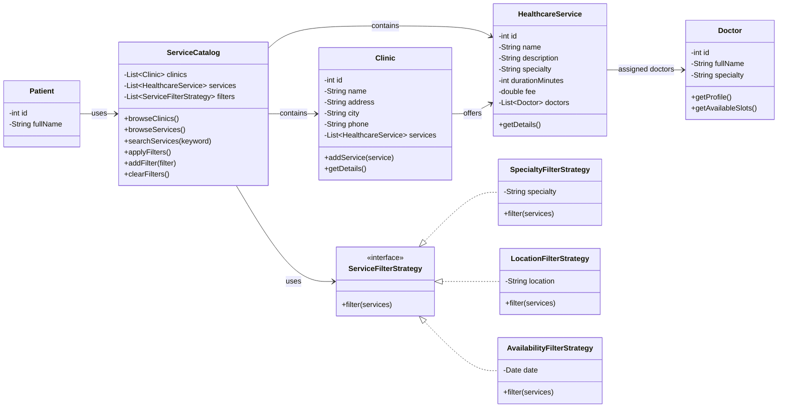

# Applying SOLID/GRASP principles + Strategy pattern:
The Patient class was simplified to only represent patient data, improving cohesion and respecting SRP.
Search and browsing responsibilities were moved to ServiceCatalog, which acts as a GRASP Controller.
Filtering logic was extracted into separate Strategy classes to respect OCP and reduce coupling.
Each filter can now be added, removed, or extended without modifying the catalog logic.
