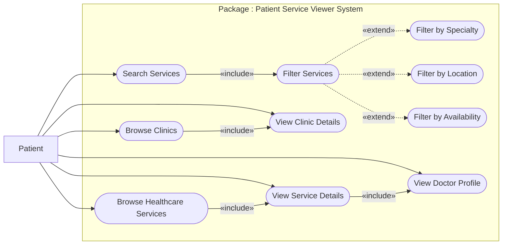

```mermaid
flowchart LR
Patient[Patient]

subgraph SystemBoundary[Package : Patient Service Viewer System]
BrowseClinics([Browse Clinics])
BrowseHealthcareServices([Browse Healthcare Services])
SearchServices([Search Services])
FilterServices([Filter Services])
FilterBySpecialty([Filter by Specialty])
FilterByLocation([Filter by Location])
FilterByAvailability([Filter by Availability])
ViewClinicDetails([View Clinic Details])
ViewServiceDetails([View Service Details])
ViewDoctorProfile([View Doctor Profile])
end

Patient --> BrowseClinics
Patient --> BrowseHealthcareServices
Patient --> SearchServices
Patient --> ViewClinicDetails
Patient --> ViewServiceDetails
Patient --> ViewDoctorProfile

BrowseClinics -->|"«include»"| ViewClinicDetails
BrowseHealthcareServices -->|"«include»"| ViewServiceDetails
SearchServices -->|"«include»"| FilterServices

FilterServices -.->|"«extend»"| FilterBySpecialty
FilterServices -.->|"«extend»"| FilterByLocation
FilterServices -.->|"«extend»"| FilterByAvailability

ViewServiceDetails -->|"«include»"| ViewDoctorProfile
```